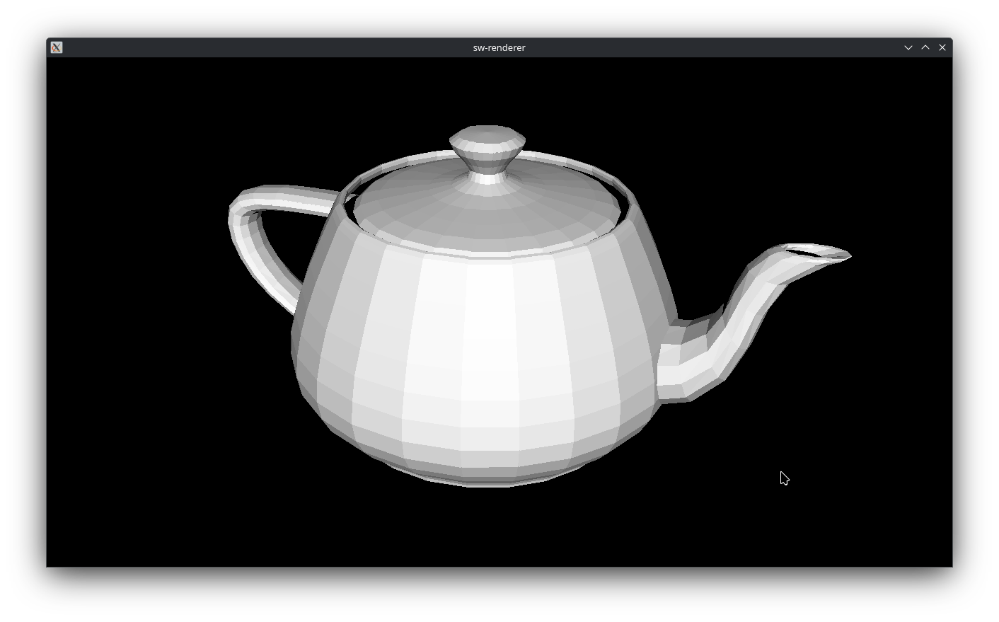

## About

A simple, low dependency, software 3D rasterizer. As of right now, I have little intention of expanding the capabilities of this project. But may do so in the future.



This project was created primarily as a learning exercise.

## Getting started

### Prequisites
- CMake https://cmake.org/
- GLM
    - https://github.com/g-truc/glm
- SDL2
    - https://wiki.libsdl.org/SDL2/FrontPage
- vcpkg https://github.com/microsoft/vcpkg (optional)
    - Clone and bootstrap according to Microsoft's instructions.
    - Install packages:
        - glm
        - sdl2

### Building
- Example build process.
```
$ git clone https://github.com/matthewgattis/sw-renderer-2.git
$ mkdir -p sw-renderer-2/build
$ cd sw-renderer-2/build
$ cmake -D CMAKE_BUILD_TYPE=Release ../
$ cmake --build .
```

### Controls
- Right click and drag to rotate the camera.
- Middle click and drag to pan the camera.
- Scroll wheel to zoom in and out.

